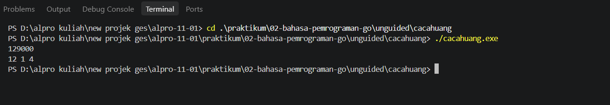
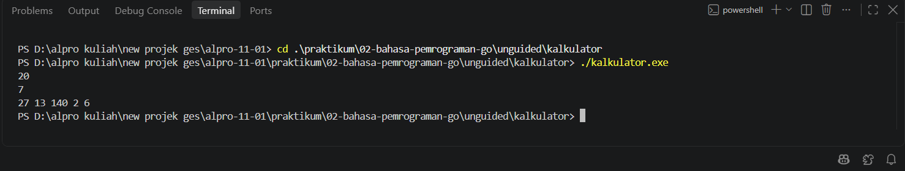

# <h1 align="center">Laporan Praktikum Modul 02 - BAHASA PEMROGRAMAN GO</h1>
<p align="center">Nabil Aqbar Kurniawijaya Putra - 109092600021</p>

## Dasar Teori

### A. Bahasa Pemrograman Go
Go adalah bahasa pemrograman yang dikembangkan oleh Google. Program Go disusun dalam package. Program yang dapat dijalankan sebagai aplikasi menggunakan `package main` dan memiliki fungsi `main` sebagai titik awal eksekusi. Kode di dalam fungsi dijalankan secara berurutan sesuai urutan penulisannya.

### B. Package, Variabel, dan Tipe Data
Package `fmt` menyediakan fungsi untuk membaca dan menampilkan data. Fungsi `fmt.Scan` membaca nilai dari masukan standar ke variabel yang alamatnya diberikan, sedangkan `fmt.Println` menampilkan nilai ke keluaran standar.

Variabel dapat dideklarasikan dengan `var`, misalnya `var jumlah int` atau `var suhu float64`. Tipe `int` digunakan untuk bilangan bulat, sedangkan `float64` dapat menyimpan bilangan pecahan. Go juga mendukung deklarasi singkat dengan `:=` di dalam fungsi, seperti `total := nilaiA + nilaiB`.

### C. Operator Aritmetika
Operator `+`, `-`, dan `*` digunakan untuk penjumlahan, pengurangan, dan perkalian. Operator `/` membagi dua nilai; jika kedua operand bertipe integer, hasilnya juga berupa integer sehingga bagian pecahan tidak disimpan. Operator `%` menghasilkan sisa pembagian dan dapat digunakan untuk memisahkan nilai berdasarkan pecahan nominal.

### D. Masukan dan Keluaran
Program-program pada praktikum ini menerima masukan melalui terminal menggunakan `fmt.Scan`, mengolah nilai dengan variabel serta operator, lalu menampilkan hasil menggunakan `fmt.Println`. Ketepatan tipe data penting agar perhitungan sesuai, misalnya menggunakan `float64` untuk konversi suhu yang menghasilkan nilai pecahan.

## Guided

### 1. skor.go
```go
package main

import "fmt"

func main() {
	var nama string
	var skorMatematika, skorBahasaIggris int

	//Membaca Input
	fmt.Scan(&nama)
	fmt.Scan(&skorMatematika)
	fmt.Scan(&skorBahasaIggris)

	//Menghitung total & rata-rata (pembagian bilangan bulat)
	total := skorMatematika + skorBahasaIggris
	rataRata := total / 2

	//Menampilkan output
	fmt.Println(nama)
	fmt.Println(total)
	fmt.Println(rataRata)
}
```

#### Deskripsi
Program membaca nama dan dua skor, yaitu skor matematika serta skor bahasa Inggris. Program menjumlahkan kedua skor, menghitung rata-rata dengan pembagian integer, kemudian menampilkan nama, total, dan rata-rata pada baris terpisah.

Contoh masukan: `Andi 80 90`

Contoh keluaran:
```text
Andi
170
85
```

### 2. suhu.go
```go
package main

import "fmt"

func main() {
	var celsius float64
	fmt.Scan(&celsius)

	reamur := celsius * 4.0 / 5.0
	fahrenheit := (celsius * 9.0 / 5.0) + 32.0
	kelvin := celsius + 273.15

	fmt.Println(reamur, fahrenheit, kelvin)
}
```

#### Deskripsi
Program menerima suhu dalam Celsius sebagai `float64`, lalu mengonversinya ke Reamur, Fahrenheit, dan Kelvin. Ketiga hasil ditampilkan dalam satu baris secara berurutan.

Contoh masukan: `25`

Contoh keluaran:
```text
20 77 298.15
```

### 3. tukar.go
```go
package main

import "fmt"

func main() {
	var a, b int

	//Membaca Input
	fmt.Scan(&a)
	fmt.Scan(&b)

	//Menukar nilai
	a, b = b, a

	//Menampilkan output
	fmt.Println(a, b)
}
```

#### Deskripsi
Program membaca dua bilangan bulat dan menukar nilainya menggunakan penugasan simultan `a, b = b, a`. Setelah pertukaran, program menampilkan nilai `a` dan `b`.

Contoh masukan: `5 9`

Contoh keluaran:
```text
9 5
```

### 4. lingkaran.go
```go
package main

import "fmt"

func main() {
	pi := 3.14
	var r, luas float64

	fmt.Scan(&r)

	luas = pi * r * r

	fmt.Println(luas)
}
```

#### Deskripsi
Program membaca jari-jari lingkaran sebagai bilangan pecahan, kemudian menghitung luas menggunakan rumus π × r × r dengan nilai π sebesar 3,14. Hasil perhitungan ditampilkan ke terminal.

Contoh masukan: `7`

Contoh keluaran:
```text
153.86
```

## Unguided

### 1. cacahuang.go
```go
package main

import "fmt"

func main() {
	var uang int
	fmt.Scan(&uang)

	sepuluhRibu := uang / 10000
	sisa := uang % 10000

	limaRibu := sisa / 5000
	sisa = sisa % 5000

	seribu := sisa / 1000

	fmt.Println(sepuluhRibu, limaRibu, seribu)
}
```



#### Deskripsi
Program menguraikan jumlah uang ke dalam banyaknya pecahan Rp10.000, Rp5.000, dan Rp1.000. Operator pembagian integer menghitung jumlah tiap pecahan, sedangkan modulo menyimpan sisa untuk perhitungan pecahan berikutnya. Keluaran berurutan menunjukkan jumlah pecahan Rp10.000, Rp5.000, dan Rp1.000; sisa di bawah Rp1.000 tidak ditampilkan.

Contoh masukan: `27000`

Contoh keluaran:
```text
2 1 2
```

### 2. kalkulator.go
```go
package main

import "fmt"

func main() {
	var a, b int
	fmt.Scan(&a, &b)

	tambah := a + b
	kurang := a - b
	kali := a * b
	bagi := a / b
	modulo := a % b

	fmt.Println(tambah, kurang, kali, bagi, modulo)
}
```



#### Deskripsi
Program membaca dua bilangan bulat, lalu menghitung penjumlahan, pengurangan, perkalian, pembagian integer, dan sisa pembagian. Hasil ditampilkan dalam urutan tersebut. Nilai pembagi harus bukan nol karena pembagian dengan nol tidak valid.

Contoh masukan: `9 4`

Contoh keluaran:
```text
13 5 36 2 1
```

## Kesimpulan
Praktikum ini melatih penggunaan struktur dasar program Go, package `main`, fungsi `main`, variabel, tipe data, masukan dan keluaran, serta operator aritmetika. Melalui program guided, konsep tersebut digunakan untuk menghitung luas lingkaran, mengolah skor, mengonversi suhu, dan menukar nilai. Pada program unguided, konsep yang sama diterapkan untuk memecah nominal uang serta membuat kalkulator aritmetika sederhana. Pemilihan tipe data dan pemahaman pembagian integer perlu diperhatikan agar hasil program sesuai dengan yang diharapkan.

## Referensi
1. The Go Authors. (n.d.). *A Tour of Go: Basics*. Diakses pada 30 September 2026 melalui https://go.dev/tour/basics
2. The Go Authors. (n.d.). *Package fmt*. Diakses pada 30 September 2026 melalui https://pkg.go.dev/fmt