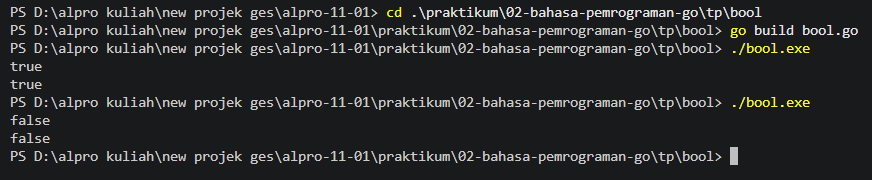
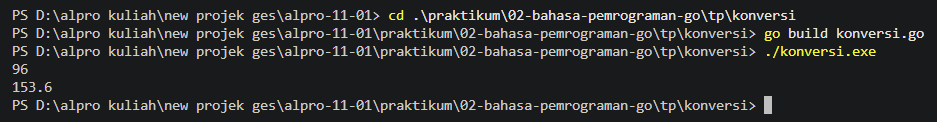
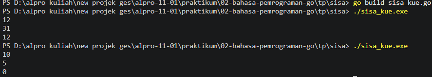

# <h1 align="center">Laporan Praktikum Modul 03 - VARIABEL DAN OPERATOR</h1>
<p align="center">Nabil Aqbar Kurniawijaya Putra - 109092600021</p>


### 1. bool.go

```go
package main

import "fmt"

func main() {
	var nilai bool
	fmt.Scan(&nilai)
	fmt.Println(nilai)
}
```

#### Output



#### Deskripsi
Program mendeklarasikan variabel `nilai` bertipe `bool`, membaca nilai logika dari terminal, lalu menampilkan kembali nilai tersebut. Program ini menunjukkan penggunaan tipe data boolean serta masukan dan keluaran sederhana di Go.

### 2. konversi.go

```go
package main

import "fmt"

func main() {
	var mil float64
	fmt.Scan(&mil)

	km := mil * 1.6

	fmt.Printf("%.1f\n", km)
}
```

#### Output



#### Deskripsi
Program membaca jarak dalam satuan mil menggunakan variabel `float64`, kemudian mengalikannya dengan 1,6 untuk memperoleh jarak dalam kilometer. Hasil ditampilkan dengan satu angka di belakang koma menggunakan `fmt.Printf`.

### 3. sisa_kue.go

```go
package main

import "fmt"

func main() {
	var y, x int
	fmt.Scan(&y, &x)

	sisaKue := y % x

	fmt.Println(sisaKue)
}
```

#### Output



#### Deskripsi
Program membaca dua bilangan bulat, lalu menghitung sisa pembagian `y` dengan `x` menggunakan operator modulo. Nilai sisa tersebut disimpan pada variabel `sisaKue` dan ditampilkan ke terminal. Nilai `x` harus bukan nol karena pembagian dengan nol tidak valid.

## Kesimpulan
Praktikum ini menerapkan penggunaan variabel dan tipe data Go, membaca serta menampilkan masukan, melakukan konversi satuan, dan menggunakan operator modulo. Tipe data yang tepat membantu program mengolah nilai sesuai kebutuhannya: `bool` untuk nilai logika, `float64` untuk perhitungan jarak, dan `int` untuk menghitung sisa pembagian.

## Referensi
1. The Go Authors. (n.d.). *A Tour of Go: Basics*. Diakses pada 30 September 2026 melalui https://go.dev/tour/basics
2. The Go Authors. (n.d.). *Package fmt*. Diakses pada 30 September 2026 melalui https://pkg.go.dev/fmt